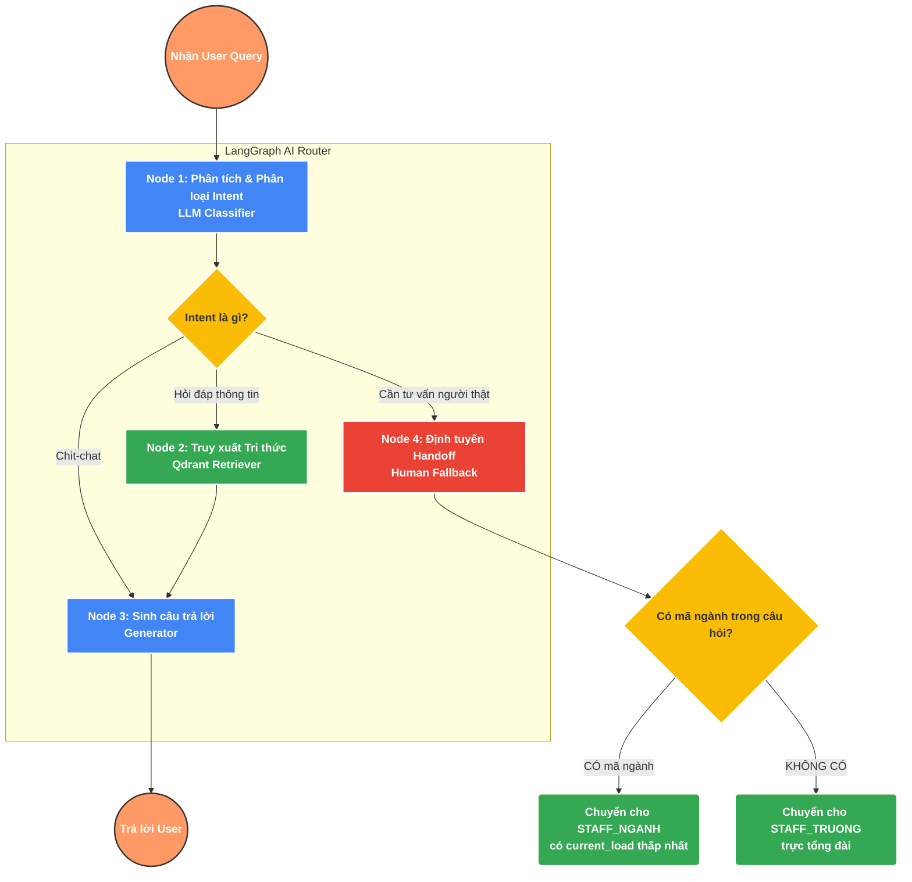

# 🧠 Kiến trúc AI: RAG & LangGraph Routing

Tài liệu này mô tả chi tiết 2 luồng xử lý AI cốt lõi trong "Hệ thống Tư vấn Tuyển sinh Đại học":
1. **Document Ingestion** (Luồng đưa tri thức vào não bộ AI).
2. **Chat Execution & Handoff** (Luồng AI phản hồi và định tuyến cuộc trò chuyện).

Hệ thống sử dụng **LangGraph** để xây dựng quy trình hội thoại stateful và **RAG (Retrieval-Augmented Generation)** kết hợp Vector Database **Qdrant** để cung cấp câu trả lời chính xác, tránh hiện tượng Hallucination.

---

## 1. 📥 Luồng 1: Document Ingestion (Import Tài liệu vào RAG)

### Mục đích
Số hóa và chuyển đổi các tài liệu phi cấu trúc (PDF Đề án tuyển sinh, Quy chế) và có cấu trúc (Excel Điểm chuẩn, Phương thức) thành dạng Vector để làm "bộ não" (Knowledge Base) nội bộ cho AI truy vấn.

### Quy trình chi tiết

1. 📄 **Data Loading (Đọc dữ liệu)**
   - Hệ thống hỗ trợ nhiều định dạng: PDF (sử dụng thư viện OCR để đọc cả ảnh quét), CSV/Excel.
   - Các file được đẩy vào Background Task để không block main thread của API.

2. ✂️ **Text Splitting / Chunking (Chia nhỏ văn bản)**
   - Do giới hạn ngữ cảnh (Context Window) của các LLM, tài liệu lớn sẽ được cắt nhỏ sử dụng `RecursiveCharacterTextSplitter`.
   - **Cấu hình chuẩn:** 
     - `chunk_size = 1000` tokens (đảm bảo đủ ý ngữ nghĩa cho một đoạn).
     - `chunk_overlap = 200` tokens (giữ lại ngữ cảnh giao thoa giữa 2 đoạn liên tiếp, tránh mất liên kết câu).

3. 🧮 **Embedding (Mã hóa Vector)**
   - Biến các đoạn text (chunks) thành ma trận số học (Vectors).
   - Hệ thống sử dụng mô hình Embedding chuyên dụng cho tiếng Việt (như `BAAI/bge-m3` hoặc `text-embedding-004`).

4. 🗄️ **Vector Store (Qdrant)**
   - Các Vector được đẩy vào **Qdrant** collection (ví dụ: `tuyen_sinh_dhv`).
   - **Metadata đi kèm:** Mỗi vector đều được gắn Metadata để hỗ trợ lọc (Filtering) chính xác khi truy vấn. Ví dụ:
     - `year: 2026`
     - `doc_type: "DE_AN"` hoặc `"QUY_CHE"`
     - `major_code: "7480201"`

---

## 2. 💬 Luồng 2: Chat Execution & Handoff (Vận hành bằng LangGraph)

Hệ thống hội thoại không chỉ là "Gọi API ChatGPT rồi trả về", mà là một quy trình (Graph) phức tạp được điều khiển bởi LangGraph nhằm phân loại, tra cứu và định tuyến.

### Sơ đồ luồng (Flowchart)



### Giải thích chi tiết các Node (Đỉnh):

* **Node 1 - Phân tích & Phân loại Intent (Classifier):** 
  Sử dụng LLM (cấu hình temperature=0 để tối đa hóa tính logic) đọc câu hỏi của thí sinh và phân loại ý định (Intent):
  - `chit_chat`: Câu chào hỏi thông thường.
  - `qa_rag`: Hỏi đáp về ngành học, điểm chuẩn, thông tin trường.
  - `handoff`: Người dùng bực tức, hỏi quá phức tạp hoặc chủ động nói "Cho tôi gặp nhân viên".

* **Node 2 - Truy xuất Tri thức (Retriever - RAG):** 
  Nếu Intent là `qa_rag`, Node này sẽ lấy câu hỏi của user để nhúng (embed) và query similarity search trên Qdrant.
  - *Chiến lược:* Lấy `top_k = 5` documents liên quan nhất. Có thể sử dụng thêm kỹ thuật Multi-Query (sinh ra nhiều câu hỏi đồng nghĩa để search).

* **Node 3 - Sinh câu trả lời (Generator):** 
  LLM đóng vai trò Tư vấn viên, nhận đầu vào bao gồm `User Query` và `Context` (Tri thức từ Node 2). LLM sẽ được tiêm (inject) System Prompt yêu cầu trả lời lịch sự, chính xác tuyệt đối dựa vào Context.

* **Node 4 - Định tuyến Handoff (Human Fallback):** 
  Được kích hoạt khi rơi vào intent `handoff` hoặc khi AI bó tay (hallucination check fail).
  - **Logic Extract:** Dùng LLM trích xuất `major_code` (Mã ngành) mà user đang đề cập.
  - **Logic Routing:** 
    - Nếu **CÓ** mã ngành ➔ Truy vấn Database tìm các `STAFF_NGANH` phụ trách mã này. Chọn người đang online và có `current_load` (số lượt chat đang tiếp) **thấp nhất**.
    - Nếu **KHÔNG CÓ** mã ngành (hỏi chung chung học phí, ký túc xá) ➔ Đẩy cho nhóm `STAFF_TRUONG`.

---

## 3. 🧠 Cấu trúc Graph State & Memory

Để các Node trong LangGraph giao tiếp được với nhau và nhớ được toàn bộ phiên chat, hệ thống sử dụng một biến trạng thái toàn cục (Graph State).

### Khai báo class `State` (TypedDict)

```python
from typing import TypedDict, List, Dict, Any, Optional
from langchain_core.messages import BaseMessage

class GraphState(TypedDict):
    """
    State lưu trữ ngữ cảnh xuyên suốt một vòng lặp của LangGraph.
    """
    messages: List[BaseMessage]       # Lịch sử hội thoại (Chat History) và câu hỏi hiện tại
    intent: Optional[str]             # Ý định phân loại từ Node 1 (chit_chat, qa, handoff)
    extracted_major: Optional[str]    # Mã ngành trích xuất được (nếu có)
    context: List[str]                # Chunks text rút trích từ Qdrant (Node 2)
    handoff_target: Optional[str]     # ID của nhân viên sẽ tiếp nhận (nếu handoff)
    current_step: str                 # Tên Node đang thực thi (dùng cho debug/telemetry)
    reply: Optional[str]              # Câu trả lời cuối cùng của AI
```

### Cơ chế ghi nhớ ngữ cảnh (Chat History / Memory)
- Field `messages` trong `GraphState` không chỉ chứa câu hỏi hiện tại mà chứa danh sách các tin nhắn trước đó.
- Nhờ lưu trữ Memory, khi user hỏi câu 1: *"Ngành công nghệ thông tin lấy bao nhiêu điểm?"* và câu 2: *"Chỉ tiêu là bao nhiêu?"*, AI (tại Node 1 và Node 2) vẫn hiểu "Chỉ tiêu" ở đây là chỉ tiêu của ngành CNTT thông qua việc đọc list `messages`.
- Khi kết thúc luồng xử lý, toàn bộ `messages` sẽ được lưu lại vào Redis hoặc PostgreSQL (Session DB) để load lại trong lần request tiếp theo của user.
