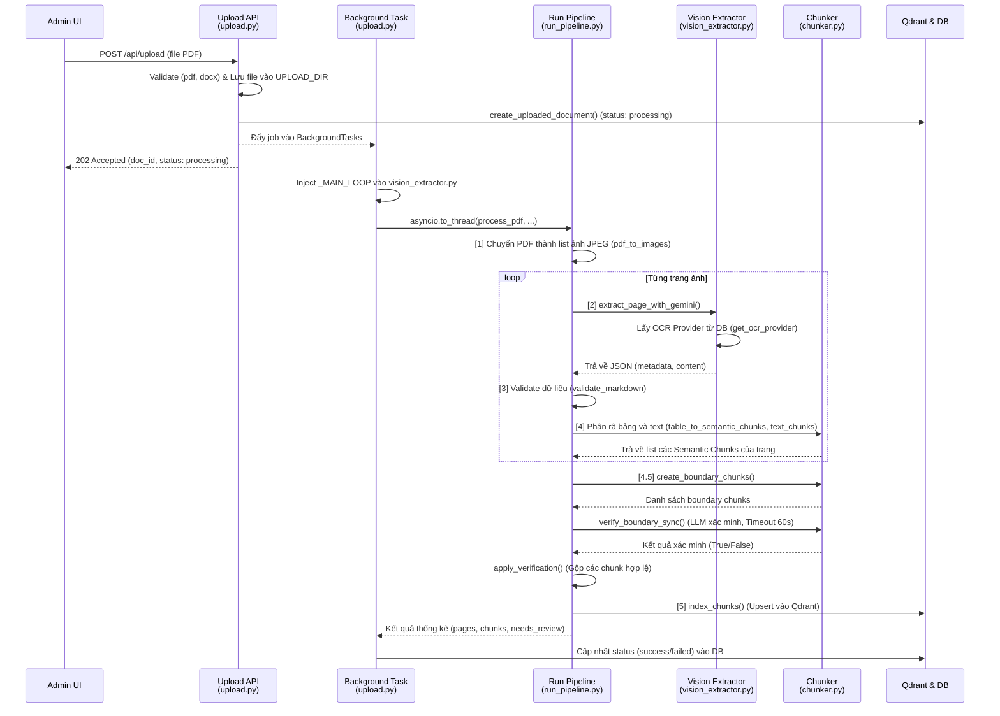
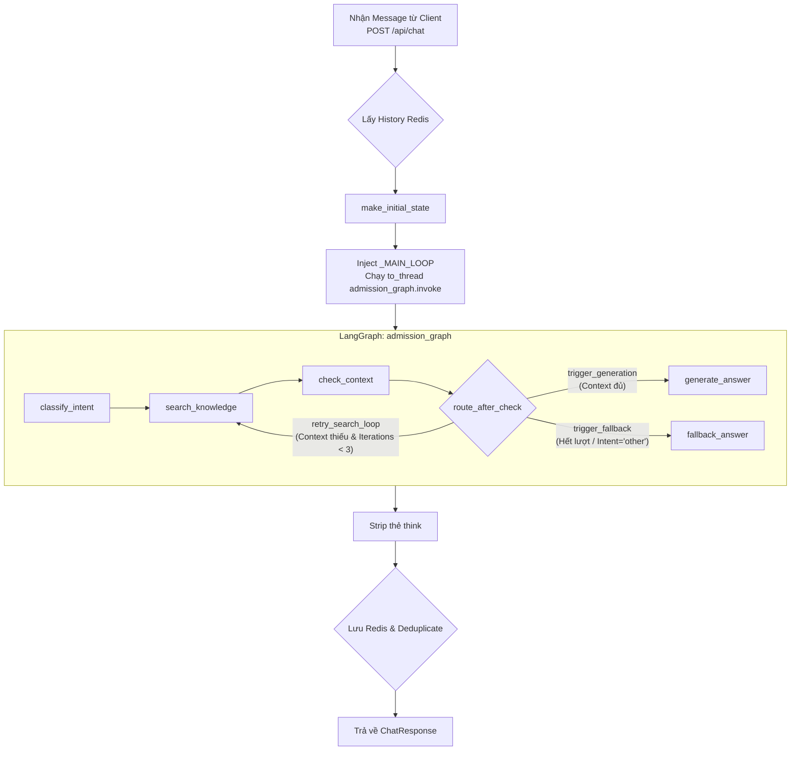

# Báo Cáo Chi Tiết Sơ Đồ Luồng Hoạt Động Hệ Thống (Code Thực Tế)

Báo cáo này mô tả chính xác 100% logic mã nguồn đang chạy hiện tại của 2 chức năng chính: Import/Indexing và Chat (RAG), kèm theo các đường dẫn file và số dòng thực tế.

## Chức năng 1: Import/Indexing (Upload file PDF)

### Chi tiết các bước thực thi (Import/Indexing)

| Tên bước | Vị trí file và dòng code | Đầu vào (Input) | Đầu ra (Output) / Thao tác | Nhánh / Điều kiện |
| :--- | :--- | :--- | :--- | :--- |
| **Nhận file & Validate** | `api/routers/upload.py:139-163` | `file: UploadFile`, `year: int` | Validate extension `.pdf`, `.docx`. | Nếu sai định dạng -> Raise HTTP 400. |
| **Lưu file tạm & Tạo bản ghi DB** | `api/routers/upload.py:165-179` | `file` | Lưu vào `UPLOAD_DIR`, gọi `create_uploaded_document`. | Nếu lỗi lưu file -> Raise HTTP 500. |
| **Kích hoạt Background Task** | `api/routers/upload.py:182-188` | `doc_id`, `file_path`, `year` | Gọi `background_tasks.add_task(process_file_background, ...)`. | |
| **Background: Setup Qdrant & Inject Loop** | `api/routers/upload.py:68-85` | Thông tin từ args | Tạo `QdrantClient`, gọi `set_main_loop(asyncio.get_running_loop())` cho vision_extractor. | |
| **Chuyển logic sang Thread Pool** | `api/routers/upload.py:88-96` | `pdf_path`, `qdrant`, `collection`,... | `await asyncio.to_thread(process_pdf, ...)` | Tránh block main async loop. |
| **Pipeline [1]: PDF to Images** | `indexing/run_pipeline.py:105-108` | `pdf_path`, `tmp_dir` | Gọi `pdf_to_images(pdf_path)`. Trả về `images` (list[str]). | |
| **Pipeline [2]: Vision Extraction** | `indexing/run_pipeline.py:120-125` | `img_path` (cho từng ảnh) | Gọi `extract_page_with_gemini(img_path)`. Trả về dict `extracted` (có `content`, `metadata`). | Gọi Provider OCR từ DB thông qua `get_ocr_provider()` (`vision_extractor.py:99`). Fallback 4 tầng JSON regex tại `_parse_json_safe` (`vision_extractor.py:135-180`). |
| **Pipeline [3]: Validation** | `indexing/run_pipeline.py:140-157` | `content` Markdown | Kiểm duyệt dữ liệu. Nếu có lỗi, đưa vào `needs_review`. | |
| **Pipeline [4]: Parse Table & Text** | `indexing/run_pipeline.py:159-179` | `content`, `meta` | Gọi `extract_tables_from_markdown`, `table_to_semantic_chunks`, `text_chunks`. Trả về `page_chunks`. | |
| **Pipeline [4.5]: Tạo Boundary Chunks** | `indexing/run_pipeline.py:183-184` | `page_chunks_by_page` (list[list[dict]]) | Tạo chunk ranh giới thông qua `create_boundary_chunks`. | Bỏ qua nếu không có Event Loop (`run_pipeline.py:182`). |
| **Pipeline [4.5]: Verify Boundary** | `indexing/run_pipeline.py:186` | `boundary_chunks`, `_MAIN_LOOP` | Gọi `verify_boundary_sync` (timeout 60s). Dùng slot LLM "ocr" (`chunker.py:339`). Trả về dict True/False. | Nếu TimeoutError hoặc lỗi -> log warning, coi như Failed (`chunker.py:389-394`). |
| **Pipeline [4.5]: Nối chunk** | `indexing/run_pipeline.py:190` | `all_chunks`, kết quả verify | Gộp chunk hợp lệ vào `all_chunks` qua `apply_verification`. | |
| **Pipeline [5]: Index Qdrant** | `indexing/run_pipeline.py:194-197` | `all_chunks` | Gọi `index_chunks`, upsert vào Qdrant. | |
| **Cập nhật status (Hoàn tất/Lỗi)** | `api/routers/upload.py:112-134` | Kết quả từ `process_pdf` | Cập nhật bản ghi DB sang `success` hoặc `failed`. | Bọc toàn bộ pipeline trong `try...except` tổng. |

---

## Chức năng 2: Chat (RAG Pipeline)

### Chi tiết các bước thực thi (Chat)

| Tên bước | Vị trí file và dòng code | Đầu vào (Input) | Đầu ra (Output) / Thao tác | Nhánh / Điều kiện |
| :--- | :--- | :--- | :--- | :--- |
| **Nhận Request** | `api/routers/chat.py:84-121` | `req: ChatRequest` | Validate payload qua Pydantic v2. Sinh `request_id`. | |
| **Tải lịch sử (History)** | `api/routers/chat.py:124-127` | `req.session_id` | Lấy list message từ Redis (`get_history`). | Fallback: Redis lỗi -> trả về `[]` (không crash). |
| **Khởi tạo State Graph** | `api/routers/chat.py:129-134` | `session_id`, `user_message`, `history` | State ban đầu `initial_state` dạng dict (AdmissionState). | |
| **Chạy LangGraph trong Thread** | `api/routers/chat.py:141-146` | `initial_state` | Inject loop qua `_nodes_set_loop`. Gọi `asyncio.to_thread(admission_graph.invoke)`. Trả về `result_state`. | Bao trong `try/except`. Lỗi Graph -> Raise HTTP 500 (`chat.py:148-162`). |
| **Node 1: Classify Intent** | `agent/nodes.py:119-168` | `user_message` | Trích xuất JSON (intents, queries, filters). Dùng `get_chat_provider().complete_json()`. | Lấy Provider từ slot "chat" (Load động mỗi node call - `nodes.py:136`). |
| **Node 2: Search Knowledge** | `agent/nodes.py:175-277` | `search_queries`, `dynamic_filters`, `iterations` | Chạy vector search trên Qdrant, gộp & deduplicate theo fingerprint. | Xác định `top_k`: Nếu query có từ liệt kê -> 20, ngược lại -> 5 (`nodes.py:175-189`). Bỏ filter tùy theo `iterations` (`nodes.py:214-224`). |
| **Node 3: Check Context** | `agent/nodes.py:283-302` | `state["iterations"]` | Tăng bộ đếm `iterations` thêm 1. | |
| **Định tuyến (Routing)** | `agent/nodes.py:305-371` | `intents`, `context`, `iterations` | Hàm `route_after_check` quyết định Node kế tiếp. | Rule 1: 'other' -> Fallback.  Rule 2: Context >= 40 char -> Generate.  Rule 3: Iterations < 3 -> Retry Search. Rule 4: Hết lượt -> Fallback. |
| **Node 4: Generate Answer** | `agent/nodes.py:378-429` | `context`, `history`, `user_message` | Sinh câu trả lời cuối cùng (`final_answer`). Gọi `complete()`. | Nếu lỗi sinh câu trả lời -> Dùng message fallback tĩnh (`nodes.py:427`). |
| **Node 5: Fallback Answer** | `agent/nodes.py:436-473` | `intents`, `iterations` | Trả lời dự phòng, gợi ý thông tin cho user. | Phân nhánh message tùy thuộc vào việc intent có phải là 'other' hay không. |
| **Làm sạch Output (Strip <think>)** | `api/routers/chat.py:167-171` | `bot_answer` | Remove toàn bộ nội dung `<think>...</think>` bằng Regex. | Tránh rác cho Reasoning Models. Nếu chuỗi rỗng -> Dùng fallback (`chat.py:174-182`). |
| **Lưu History (Redis)** | `api/routers/chat.py:184-201` | Lịch sử được trim (cắt) lại tối đa 20 messages. | Lưu vào Redis (`save_history`). | Fallback: Lỗi Redis -> chỉ ghi log warning, không ảnh hưởng API (`chat.py:196`). |
| **Lọc Source (Deduplicate)** | `api/routers/chat.py:43-77` | `search_results` | Loại bỏ source file trùng lặp bằng thủ thuật `dict.fromkeys()`. | Đảm bảo giữ nguyên thứ tự ưu tiên (score cao xếp trước). Trả ra client. |

---

## Ghi chú về sự khác biệt giữa Source Code và các phiên bản/thiết kế cũ
*Các điểm dưới đây được liệt kê do phát hiện sự khác biệt giữa file báo cáo hiện tại (nếu có) và mã nguồn thực tế:*

1. **Boundary Chunking (Nối Chunk xuyên trang):** Hoàn toàn mới trong Pipeline Import (bước 4.5). Có sử dụng LLM OCR verify tính liên tục với timeout cứng là 60s và fallback an toàn tránh sập pipeline.
2. **Event Loop Injection (`_MAIN_LOOP`):** Hai module `api/routers/upload.py` và `api/routers/chat.py` sử dụng hàm inject loop thủ công trước khi chuyển task sang thread bằng `asyncio.to_thread`.
3. **Dynamic Top-K trong Search:** Search Knowledge Node nhận diện từ khoá liệt kê (như "tất cả", "danh sách") để tự động tăng `top_k` lên 20 (thay vì cố định 5).
4. **Hệ thống Slot Động:** Tất cả các Node gọi LLM đều không hardcode nhà cung cấp. `get_ocr_provider()` và `get_chat_provider()` được gọi trực tiếp trong runtime bên trong closure `_call()` nhằm đáp ứng cơ chế thay đổi Provider on-the-fly qua Admin UI.
5. **Strip `<think>` Tags:** Tại quá trình xử lý output của Chat router, hệ thống đã thêm logic RegEx cắt gọt nội dung `<think>...</think>` để clean-up dữ liệu trước khi hoàn tất request, dành riêng cho các mô hình Reasoning.
6. **Thuật toán Deduplication ở Search Sources:** Code sử dụng trick `list(dict.fromkeys(raw_sources))` để gỡ trùng lặp tên nguồn mà không làm xáo trộn điểm (score) đánh giá gốc từ vector database.
